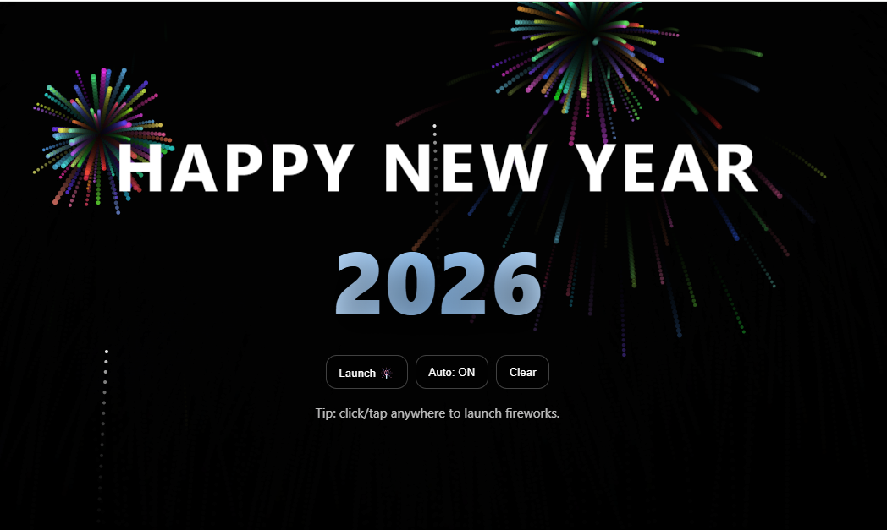

# New-Year-Animation-HTML-CSS-and-JavaScript
A single-page demo using HTML + CSS + vanilla JS (canvas fireworks + UI text), with a second demo page for “CSS-only”.



A small demo project using:

- CSS for layout + text shimmer
- JavaScript + Canvas for fireworks particles

## Run locally
Just open `index.html` in your browser.

### Dynamic Year Logic
The displayed year is calculated dynamically using JavaScript:

```javascript
const today = new Date();
const currentYear = today.getFullYear();
const nextNewYear = new Date(currentYear + 1, 0, 1); // Jan 1 of next year
const targetYear = today < nextNewYear ? currentYear + 1 : currentYear + 2;
```

**How it works:**
- Calculates the date of the next January 1st
- If today is before that date, shows `currentYear + 1` (the upcoming celebration)
- If today is on or after that date, shows `currentYear + 2` (next year's celebration)
- **Example:** Dec 29, 2025 → shows **2026** | Feb 1, 2026 → shows **2027**
- The "Happy New Year" message applies throughout January and remains correct year-round
- Self-correcting: no page reload needed, works indefinitely into the future

### Security disclaimer
This project is for educational purposes only. Do not use this implementation directly in production. Real systems should use secure key management, durable refresh token storage, and proper monitoring.

### License
This demo is provided as-is for learning and experimentation.
